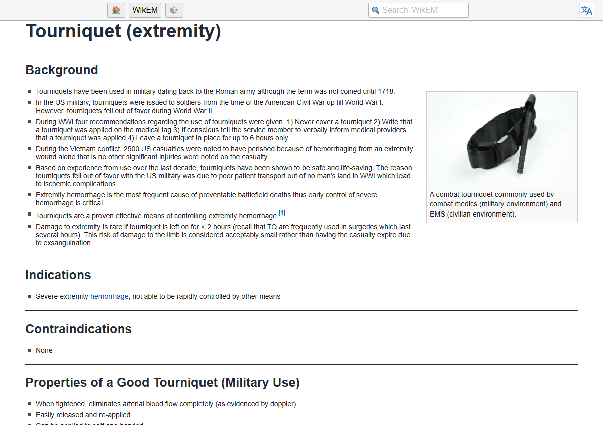

# Wasteland AI

**A ~10 W always-on knowledge node + an on-demand 70B-class workstation, all
inside ~1 kWh/day of winter sun.** The big box sleeps; the library never does.

## What it answers when everything else is down

No internet, no cloud, no login server — a Raspberry Pi on a battery, serving:

- **"How do I close this wound?"** — suturing, wound care, tourniquets,
  fractures, burns, childbirth: WikEM emergency medicine + Hesperian's
  *Where There Is No Doctor*, returned **verbatim with citations** — never
  AI-improvised (see below)
- **"How much bleach makes this water safe?"** — WHO/CDC treatment and
  dosing tables, including how long to boil at *your* altitude
- **"How do I fix it?"** — the full iFixit repair library, wikiHow, vehicle
  factory service manuals, and a datasheet tree for the exact hardware you own
- **"Can I pressure-can this at 6,000 ft?"** — USDA canning tables, shown
  not paraphrased, because botulism doesn't negotiate
- **"What wire gauge? What fuse? Series or parallel?"** — ampacity and
  sizing tables plus [pre-drawn solar/battery wiring diagrams](02_CORPORA/reference_tables/WIRING_DIAGRAMS_SOLAR.md)
  a first-timer can follow (including the classic 4-panels-in-series
  mistake that kills charge controllers)
- **"Teach me the deep stuff"** — all of offline Wikipedia, ~65 GB of
  Project Gutenberg books, the Navy's NEETS electronics course, Stack
  Exchange archives (electronics, ham, DIY, gardening, mechanics, …),
  US Army field manuals
- **"Rebuild it from scrap"** — the bootstrap tier: metallurgy and
  heat-treat data, Gingery machine-tools-from-scrap, welding guides,
  charcoal / lime / cement / glass / leather production
- **Write code, offline** — a sandboxed **agentic coding loop**
  (`pi_agent.py`) with MicroPython examples, jailed to a scratch SSD so it
  can't hurt the archive
- **From miles away, no infrastructure** — DM the node `?med tourniquet`
  over **Meshtastic LoRa** and get verbatim WikEM back in 200 characters

*Not a mockup: WikEM's tourniquet article served on localhost from a 375 MB
ZIM by kiwix-serve — the `?med tourniquet` source, exactly as the radio path
retrieves it, no internet anywhere in the loop.*

**Sizes, honestly:** ~5 GB = pocket emergency copy · ~60 GB = the Pi core
(Wikipedia + medicine + repair at 8 watts) · ~300 GB = the full library.
This repo is the **blueprint + working, reviewed code**; the library itself
is free public downloads (Kiwix ZIMs and friends) — [MANIFEST.md §8](00_DOCS/MANIFEST.md)
is the complete shopping list with sources and torrents.

**Want in tonight? → [QUICKSTART.md](QUICKSTART.md)** — five minutes on any
computer with no hardware (watch the safety router prove itself), or one
evening for the offline-library demo that sells the whole idea.

## Pick your tier — Tier A is the point

Ten people starting at Tier A beat one person forever refining Tier C.

| Tier | Cash | Power | What it runs | Winter honesty |
|---|---|---|---|---|
| **A — Garage** | $0–150 | A panel or power station you already own; salvaged battery as buffer | The Pi knowledge node, 24/7 most of the year | Browns out in a hard December — fine; it's a library, not life support |
| **B — Value** | ~$500 | 100 Ah LiFePO4 + 200 W panel + MPPT | Knowledge node + small-model AI sessions | Survives most winters with load discipline |
| **C — December-proof** | ~$1,500 | 200 Ah self-heating LiFePO4 + 400 W array + Victron | The full stack, incl. the on-demand 70B box | Designed against the worst month — the [MANIFEST](00_DOCS/MANIFEST.md) §1 math is this tier |

If you only ever build Tier A — Pi + Kiwix + the medical ZIMs — **you
already own the highest-value part of this entire project.** Everything
past that is capability, not survival.

## The part worth arguing about

The AI is **not allowed to freelance on dangerous topics**. Six domains —
medical, ammo reloading, canning, electrical sizing, structural, water
dosing — are hard-routed to retrieval-only: verbatim source + citation, no
generation. Enforced by [a router you can audit in two minutes](05_SCRIPTS/safety_router.py)
(`python safety_router.py --test` shows the contract), not by a prompt asking
nicely. The model is smart enough to help you; it is not authoritative
enough to invent reality — so it always has a source outside itself to
appeal to.

And the radio side is a keyhole, not a door: DM-only, 200-char cap,
rate-limited, allowlist-gated. Threat model, login hardening, and the
"can someone inject a virus over LoRa?" answer live in
[SECURITY.md](00_DOCS/SECURITY.md).

## What's in this repo

This repo is the **public release subset** — docs and code only. The
[.gitignore](.gitignore) is a whitelist: the full build's inventory, radio
configs (private keys!), logs, models, and corpora live in the same folder
tree locally but *cannot* be committed by accident.

| Path | What |
|---|---|
| [QUICKSTART.md](QUICKSTART.md) | **Start here.** Three on-ramps: 5-minute no-hardware, one-evening library demo, the full Pi build |
| [00_DOCS/MANIFEST.md](00_DOCS/MANIFEST.md) | **The build doc.** December power math (with the GHI-vs-POA trap), 12 V/24 V fork, cold-Voc rules, battery economics, Meshtastic security reality check, build order |
| [00_DOCS/SECURITY.md](00_DOCS/SECURITY.md) | Threat model: the radio keyhole, who can query you (allowlist), malware reality, login hardening, seizure trade-offs |
| [00_DOCS/CODE_REVIEW_2026-08-25.md](00_DOCS/CODE_REVIEW_2026-08-25.md) | Adversarial review findings on the v1 scripts, and what was fixed |
| [00_DOCS/APP_SHELF.md](00_DOCS/APP_SHELF.md) | Prepackaged software worth carrying: the five-point filter, the core/task shelves, the rejects (with reasons), and the A/B + signed update model |
| [00_DOCS/FUTURE_FEDERATION.md](00_DOCS/FUTURE_FEDERATION.md) | Where this goes next: specialist nodes exchanging hash-cited knowledge claims over LoRa — design sketch, strictly post-boot territory |
| [05_SCRIPTS/](05_SCRIPTS/) | The working code (below) — see its [README](05_SCRIPTS/README.md) for Pi setup, step by step |

| Script | What it does |
|---|---|
| `verify_checksums.py` | Fingerprints the archive so bit rot can't hide (Windows↔Pi portable) |
| `power_monitor.py` | Victron VE.Direct telemetry: checksum-validated frames, CSV log, GREEN/YELLOW/RED/BLACK band. `--demo` = fake sun, real band logic |
| `lora_oracle.py` | The mesh bot: `?power` `?med` `?find` `?ask`, DM-only, 200-char cap, rate-limited, allowlisted. `--demo` = the bot at your keyboard, no radio |
| `safety_router.py` | Classifies every question before any model runs; `--test` is the executable contract |
| `pi_agent.py` | Minimal agentic coding loop jailed to a scratch SSD (ships disabled — read its docstring) |
| `make_skeleton.py` | Rebuilds the full folder tree after a bare clone |

## Status

- Build doc adversarially reviewed by three different AI models, revised twice.
- All four v1 scripts reviewed against library source + protocol specs and
  fixed; the VE.Direct parser is unit-tested against synthetic frames; and
  the `?med` retrieval path is **verified against a live kiwix-serve**
  (3.8.1), including automatic book-name discovery.
  Stable snapshot: [Releases](https://github.com/SkyWhal3/Wasteland-AI/releases).

## Help wanted — first-contact missions

Two code paths have never touched their hardware, and one fix wants more
witnesses. No better first contribution exists:

- [#1 — Live VE.Direct stream](https://github.com/SkyWhal3/Wasteland-AI/issues/1): plug the cable in, post real frames
- [#2 — Meshtastic end-to-end](https://github.com/SkyWhal3/Wasteland-AI/issues/2): DM the Oracle from a second node
- [#3 — Your kiwix version](https://github.com/SkyWhal3/Wasteland-AI/issues/3): `--demo` + kiwix-serve, five minutes, no radio

**Run it. Break it. File issues.**

## License

[MIT](LICENSE). Fork it, adapt it to your site, share what you learn.
